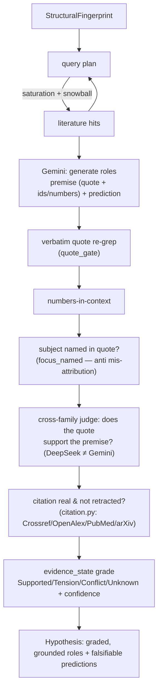

# flyhypo architecture — grounding & verification (target design)

> Status: **design / upgrade plan**, not yet implemented. It records where flyhypo is going
> and how the pieces slot in, so the code can catch up incrementally. Today's verification is
> a single same-model second pass (see "Current" below); this doc is the target.

flyhypo's core promise is that **every claim traces to a specific paper or connectivity number,
and nothing is fabricated**. That promise is only as strong as the *verification* behind it. This
document upgrades flyhypo's verification from "ask the same model to check itself" to a layered,
mostly-deterministic anti-hallucination stack — reusing [`paper-evidence`](https://github.com/ChiShengChen/paper-evidence)
(a domain-neutral literature-evidence + claim-grounding library) as the verification layer.

## Current (v0)

```
cell type ─▶ connectome.py ─▶ StructuralFingerprint ─┐
            literature.py ─▶ [LiteratureHit]         ├─▶ synthesize.py ─▶ Hypothesis
              (PubMed abstracts, keyword queries)     │     Gemini generate,
                                                       │     then Gemini verify (self-check)
                                                       └─────┘
```

Weaknesses the last round of work exposed:

- **Self-grading.** The verify pass is Gemini checking Gemini — a shared blind spot, not an
  independent check.
- **No verbatim tie.** A claim cites a paper id but is not pinned to a *verbatim quote*; paraphrase
  drift and invented numbers survive.
- **Citations unverified.** "Strip ids not in the evidence" ≠ "the cited PMID/DOI is real and not
  retracted." An id the model invented but *echoed into the evidence bundle* can slip through.
- **Confidence is a model opinion.** Tiering is LLM judgment, not a rule; over-claim and
  abstract-only depth aren't systematically capped.
- **Coverage unknown.** Queries are built once from the fingerprint — no saturation, snowball, or
  recall measurement.

## Target (v1): the anti-hallucination stack

Each claim becomes a **premise** (what is attributed to the literature/connectome, carrying a
verbatim quote + the ids/numbers it rests on) plus a **prediction** (the novel, falsifiable leap).
**Only the premise is verified; the prediction is the hypothesis and rides along, labelled novel.**



### The guards (mostly deterministic; from `paper-evidence`)

| Guard | What it kills | Module |
|---|---|---|
| **Verbatim quote re-grep** | paraphrase drift — a claim whose "quote" isn't actually in the abstract | `quote_gate.verify_quote` |
| **Numbers-in-context** | a connectivity/stat number that isn't next to the text it supposedly comes from | `quote_gate` (num_window) |
| **Mis-attribution guard** | a real quote about the *wrong* cell type (MBON01 vs MBON12, EPG vs PEG) — the focus must be **named in its own quote** | `quote_gate.focus_named` (card `subject` = the cell type + aliases) |
| **Cross-family faithfulness** | the premise overstates the quote — judged by a **different model family** (DeepSeek), so it isn't Gemini grading Gemini | `quote_gate.make_judge` |
| **Citation reality + retraction** | an invented or **retracted** PMID/DOI grounding a hypothesis | `citation.verify_citation` |
| **Evidence grading** | over-confidence — deterministic tiers, not a model's mood | `evidence_state.classify` |

### Evidence grading rules (deterministic — a strong fit for flyhypo)

`evidence_state` grades each premise `Supported / Tension / Conflict / Unknown` + a confidence tier,
with three rules that map cleanly onto flyhypo's reality:

- **overclaim = positive mis-attribution only.** A quote that says the wrong thing is an overclaim;
  a paper simply *not mentioning* the cell is **not**.
- **silence → Unknown, never Conflict.** An abstract that doesn't discuss a role is Unknown — flyhypo
  must not read absence as contradiction.
- **abstract-only caps confidence ≤ Med.** flyhypo is *entirely* abstract-level for literature, so its
  literature-grounded premises should cap at Med by construction (matches the existing single-neuron
  `low` cap, generalized). Full-text deep-read (below) is what lifts that ceiling.

## Coverage: know when you've searched enough

`literature.py` gains a recall layer (`paper-evidence.recall`): build query variants from the
fingerprint (cell type + aliases + neuropils + top partners), **stop only after *k* zero-yield
batches** (saturation), **snowball** citations from the best hits, and **audit recall** against a
review's reference list. Reworded queries are handled by **semantic anchoring** (`semantic.py`,
embedding similarity) so a paper that never uses the neuPrint ROI code still surfaces.

## Full text when it's open access

For the open-access subset of hits, `deepread.py` (PDF/URL/PMC → verbatim cards) replaces
abstract-only evidence for those papers — which, per the grading rule above, is what allows a
premise to exceed Med confidence.

## Migration path (incremental, each a small PR)

1. Add `paper-evidence` as a dependency; wrap each generated role as a card `{subject, claim, quote, numbers}`.
2. Replace the same-model verify pass with `quote_gate.build(..., judge=make_judge())` (verbatim +
   numbers-in-context + mis-attribution + cross-family judge). Drop failing cards, don't "downgrade".
3. Run `citation.verify_citation` on every cited PMID/DOI; drop unverified, flag `RETRACTED`.
4. Replace LLM confidence with `evidence_state.classify` (keep the model's tier only as a hint).
5. Add the `recall` layer (saturation + snowball + audit) to `literature.py`; then `semantic` anchoring.
6. Add `deepread` for OA hits to lift the abstract-only confidence ceiling.

Steps 1–4 are the high-value core (independent verification + real citations + honest grading);
5–6 are recall/depth. None require changing the connectome layer.

## Why reuse `paper-evidence`

It is the domain-neutral extraction of exactly this anti-hallucination machinery (built and hardened
on real literature, including fruit-fly papers), with the verification core as **stdlib, zero-dep,
offline**. flyhypo stays the *application* (connectome + fly domain + UI); `paper-evidence` is the
*verification library*. See its README for the full API.
