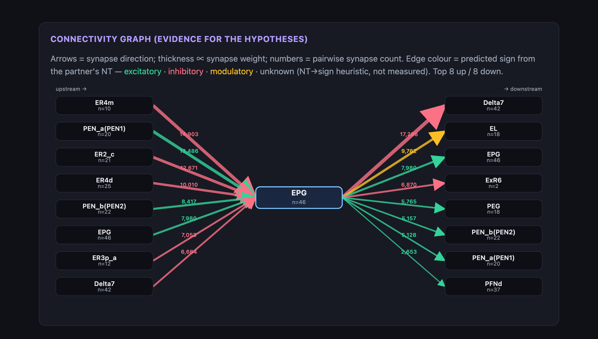
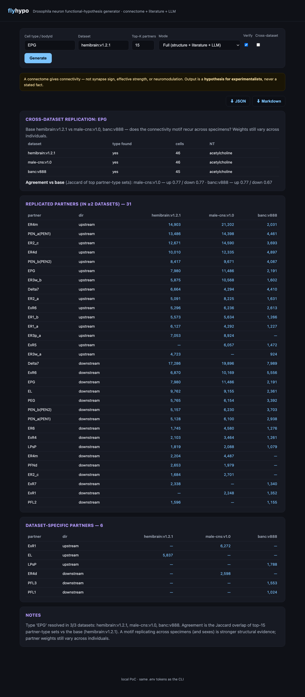
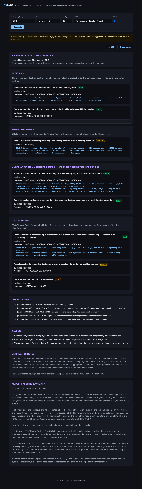

# flyhypo

**A Drosophila neuron functional-hypothesis generator (proof of concept).**

Given a fly cell type (e.g. `EPG`, `MBON01`), `flyhypo` combines **structural
evidence** from a connectome (neuPrint) with **functional evidence** from the
literature (PubMed), then asks an LLM (Google Gemini) to synthesise **the
functional roles the neuron is involved in — each grounded in a paper id and/or a
specific connectivity number** — plus tiered, falsifiable hypotheses. Output as
structured JSON + a readable Markdown report.

> **Core principle.** A connectome tells you *who connects to whom and roughly
> how strongly*, but **not** synapse sign, effective/intrinsic strength, or
> neuromodulation — and connection weights vary across individuals. So every
> output is a **hypothesis for experimentalists, never a stated fact**. Each
> claim traces to a specific connectivity number or a specific paper. When
> evidence is thin, the tool says so and lowers confidence — it never fabricates.



*Connectivity graph (from the web UI) for `EPG`: top-8 upstream → EPG → top-8
downstream, edge thickness ∝ synapse weight. **Edge colour = predicted synapse
sign** from the partner's neurotransmitter — <span>excitatory</span> (green) /
inhibitory (red) / modulatory (amber) — so the ring-attractor's excitatory
PEN/EPG recurrence vs inhibitory ring-neuron input reads at a glance. A NT→sign
heuristic, always labelled predicted.*

---

## How it works

```
                  ┌ connectome.py (neuPrint) ───────────────────────────────────┐
 cell type / ────▶│ type · single-neuron (bodyId) · region-aware suggestions     │
   bodyId         │ NT borrowed from male-cns · cross-dataset replication         │─┐
                  │   (hemibrain · male-cns · banc · FlyWire via flywire.py)      │ │
                  └──────────────────────────────────────────────────────────────┘ │─▶ StructuralFingerprint
                  ┌ literature.py (PubMed via paper-search-mcp) ─────────────────┐ │        │
                  │ queries from the fingerprint · saturation · snowball · semantic│─┘        ▼
                  └──────────────────────────────────────────────────────────────┘   synthesize.py (Gemini,
                                                                                       temp 0, reasoning)
   functional_roles + tiered hypotheses + hierarchy (region ▸ subregion ▸ umbrella ▸ ◀──┘
   cell type ▸ neuron)                        │
                                              ▼
   verify.py  — paper-evidence: verbatim-quote re-grep · mis-attribution guard ·
                cross-family judge · citation/retraction · abstract-only grading
   numverify.py — every cited synapse number must exist in the fingerprint
   + connectivity-salvage · unstudied-type humility cap · single-neuron cap
                                              │
                                              ▼
   Hypothesis / HierarchyReport / ReplicationReport ─▶ JSON + Markdown · web UI
                                              └─▶ flyhypo-batch → flyhypo-eval (gold-set scorer)
```

| Module | Responsibility |
|---|---|
| `schema.py` | Pydantic data contracts (fingerprint, roles, hypotheses, hierarchy, replication). |
| `connectome.py` | Typed wrapper over `neuprint-python`: type / single-neuron fingerprint, region-aware suggestions, NT enrichment from a sibling connectome. *(Liftable into a standalone MCP server.)* |
| `literature.py` | Builds queries from the fingerprint; PubMed via `paper-search-mcp`, with saturation-aware retrieval, citation snowball, and semantic re-ranking. |
| `synthesize.py` | Gemini (temp 0, explicit reasoning) → functional roles + tiered hypotheses; folds cross-dataset replication in as evidence; applies the guards below. |
| `verify.py` | Anti-hallucination via [`paper-evidence`](https://github.com/ChiShengChen/paper-evidence) (≠ Gemini): verbatim re-grep, mis-attribution guard, cross-family judge, citation/retraction, deterministic grading. |
| `numverify.py` | Deterministic: every synapse-scale number a claim cites must exist in the fingerprint / replication. |
| `hierarchy.py` | Resolves & analyses region ▸ subregion ▸ umbrella ▸ cell-type ▸ neuron. |
| `replication.py` · `flywire.py` | Cross-dataset motif replication across neuPrint datasets + the FlyWire (FAFB) static export. |
| `cli.py` · `web.py` · `mcp_server.py` | `flyhypo …` CLI, the local web UI, and an MCP server (`flyhypo-mcp`) exposing the engine as tools. |
| `batch.py` · `eval.py` | Batch generation and the gold-set scorer (`flyhypo-batch`, `flyhypo-eval`). |

The verification design (and why it isn't Gemini grading Gemini) is written up in
[`ARCHITECTURE.md`](ARCHITECTURE.md).

---

## Prerequisites

- **Python 3.12+** and **[uv](https://docs.astral.sh/uv/)**.
- A **neuPrint token** — log in at <https://neuprint.janelia.org> (Google
  account), then *your name (top-right) → Account* and copy the auth token. The
  default dataset `hemibrain:v1.2.1` needs no special access.
- A **Google Gemini API key** — <https://aistudio.google.com> → *Get API key*.

PubMed needs no key.

## Setup

```bash
uv sync                 # install deps
cp .env.example .env    # then paste your two tokens into .env
```

## Run

```bash
# Full pipeline (needs both tokens):
uv run flyhypo EPG
uv run flyhypo MBON01 --dataset hemibrain:v1.2.1 --top-k 15 --out outputs/

# Just the structural fingerprint — only needs the neuPrint token:
uv run flyhypo EPG --fingerprint-only

# Unknown type → graceful fuzzy suggestions, no crash:
uv run flyhypo SA1 --fingerprint-only

# Single-neuron mode — structural fingerprint for one bodyId:
uv run flyhypo --neuron 387364605

# Multi-level analysis — region ▸ subregion ▸ umbrella ▸ cell type ▸ neuron:
uv run flyhypo EPG --hierarchy
uv run flyhypo --neuron 387364605 --hierarchy

# Cross-dataset replication — does the motif hold in another connectome?
uv run flyhypo EPG --replicate                       # vs male-cns + banc (default)
uv run flyhypo EPG --replicate male-cns:v1.0,banc:v888

# Batch-generate many types, then grade them against the gold set:
uv run flyhypo-batch EPG MBON01   # (or no args → every eval/gold type)
uv run flyhypo-eval               # all gold types with an outputs/ file
uv run flyhypo-eval EPG MBON01
```

> **Predicted NT is borrowed from a sibling connectome.** hemibrain stores no
> neurotransmitter, so when it's missing flyhypo borrows a *prediction* from
> `male-cns:v1.0` (matched by `hemibrainType`) and labels it as such in
> `predicted_nt_source` — e.g. EPG → *acetylcholine*, MBON01 → *glutamate*. Still a
> prediction, cross-dataset; disable with `FLYHYPO_NT_ENRICH=0`.

> **Verification strictness is tunable** (`FLYHYPO_VERIFY_STRICT=0` → lenient). The
> literature gate drops claims whose verbatim quote can't be re-grepped from the
> cited abstract; lenient keeps them but tiers their confidence down. Connectivity
> claims are grounded by the deterministic number guard instead. Grading the gold
> set (`flyhypo-eval`) is how these knobs get tuned — doing so surfaced that
> connectivity-only hypotheses were being mis-dropped, lifting recall 0.58 → 1.00.

Outputs land in `outputs/<cell_type>.json` and `outputs/<cell_type>.md`.

> **Tip — pass a cell *type*, not a brain region.** flyhypo resolves cell *types*.
> Neuropil / region names like `MB` (mushroom body), `EB`, `FB`, `PB` are **ROIs**,
> not types — so querying one resolves to no cells. The tool detects this, says so,
> and suggests representative cell types that arborize in that region (e.g. `MB` →
> Kenyon cells `KCg-m`, `KCab-c`, …; plus the 36 `MBON…` output neurons). Pass an
> actual type instead: `KCg-m`, `MBON01`, `EPG`. Unknown/typo'd types fall back to
> fuzzy name suggestions.

> **Tip — predicted synapse sign.** A connectome gives no synapse sign, but each
> partner now carries a **predicted sign** from its neurotransmitter (borrowed from
> `male-cns`): ACh → excitatory, GABA / glutamate → inhibitory, aminergic →
> modulatory. It colours the graph edges and lets hypotheses reason about
> excitation vs inhibition — always **labelled predicted** (a NT→sign heuristic,
> not measured; glutamate is only *usually* inhibitory in flies). Effective
> strength and neuromodulation remain unknown.

> **Tip — what the numbers mean.** ROI tables show **synaptic *site* counts**
> (pre/post sites summed over the cells); partner `w` / "synapse count" is the
> **pairwise synapse count** (synapses between neuron pairs, summed over the type).
> Both are structural proxies — not functional strength, sign, or reliability.

> **Single-neuron mode & its limits.** `--neuron <bodyId>` (or a numeric query in
> the web UI) fingerprints one individual neuron. The **structure** is genuinely
> single-cell — its own partners, ROIs, and **topographic position** (instance +
> sub-compartments, e.g. EB wedges / the PB glomerulus). But a single cell's
> **function is inherited from its type**; its only cell-specific signal is *where
> in the map* it sits. So hypotheses are **capped at `low` confidence** and the
> report states the hard gaps explicitly: there is **no literature for an
> individual neuron** (citations are type/region-level), connectivity is from
> **one fly (n=1)** so a cell's wiring can't be separated from individual /
> reconstruction idiosyncrasy, and synapse sign/strength/neuromodulation stay
> unknown. Closing those needs cross-individual data (FlyWire) + single-cell
> physiology — out of scope here.

> **Multi-level mode (`--hierarchy`).** Reports functional roles at **every level**
> of the hierarchy, each role grounded in paper id(s) and/or connectivity numbers:
> **region** (neuropil, e.g. `EB`) ▸ **subregion** (compartment, e.g. `EBr2r4`) ▸
> **umbrella** (the functional *system* / type-family — **named by the model**,
> e.g. "central-complex compass system (EPG/PEN/PEG)", grounded in refs + shared
> wiring) ▸ **cell type** (`EPG`) ▸ **neuron** (a bodyId, capped at `low`).
> Region/subregion come from neuPrint ROIs and the type's dominant compartments;
> coarser levels describe the region/system as a whole, not the single cell. Tip:
> run once to warm the cache — the first uncached run makes many live neuPrint
> calls and can be slow on a flaky connection.

> **Cross-dataset replication (`--replicate`).** Checks whether a type's
> connectivity motif recurs in **other connectomes on neuPrint** — by default
> `male-cns:v1.0` (a male whole-CNS specimen) and `banc:v888` (brain+nerve cord) —
> i.e. a different individual, even a different sex. It's **structural only** (no
> LLM): it reports per-dataset cell counts, the **Jaccard agreement** of the
> top-K partner-type sets vs the base, and a table of partner types that
> **replicate across ≥2 datasets** (with side-by-side synapse weights) vs
> dataset-specific ones. A motif that recurs across specimens is stronger
> structural evidence; absolute weights still vary across individuals. (E.g.
> `EPG`'s compass partners — ER*, PEN, Delta7, EL, PEG — replicate across
> hemibrain ♀, male-cns ♂, and banc.) In the **web UI** (Replicate mode) each
> dataset is a column; FlyWire (FAFB) joins automatically when `FLYWIRE_DATA_DIR`
> is set.



*Replicate mode: EPG's compass partners with side-by-side synapse weights across
hemibrain ♀, male-cns ♂, and banc; NT (acetylcholine) borrowed from male-cns.*

### Web UI

A minimal local web UI (stdlib-only, same `.env` tokens) wraps the CLI:

```bash
uv run flyhypo-web            # → http://127.0.0.1:8000
```


*Hierarchy mode (with the **Verify** toggle on) — functional roles at every level,
region → cell type, each grounded in refs + connectivity:*



Type a cell type (or a numeric bodyId) and pick a **Mode** — **Full**, **Hierarchy**
(region ▸ subregion ▸ umbrella ▸ cell type ▸ neuron), **Replicate** (cross-dataset
motif), or **Fingerprint only**. Two checkboxes: **Verify** (the second LLM pass)
and **Cross-dataset** (fold replication into the synthesis as evidence). The page
renders:

- **functional roles** — the headline answer: the functions this neuron is
  implicated in, each tagged literature / connectivity / both, with the paper ids
  and connectivity numbers that ground it;
- the **structural fingerprint** (input/output ROI tables, up/down-stream partner tables);
- a **connectivity graph** (inline SVG) — the target in the centre, upstream partners
  on the left and downstream on the right, edge thickness ∝ synapse weight, with the
  synapse count and cell-count `n` labelled and full details on hover (top 8 each side);
- **tiered hypotheses** colour-coded by confidence, linked literature (PMID/DOI →
  pubmed/doi.org), proposed experiments, the not-supported section, and verification notes.

Other niceties:

- **⬇ JSON / ⬇ Markdown** download buttons on each result.
- A **Saved reports** strip (everything in `outputs/`) with relative timestamps; click to
  re-open a past report, or **✕** to delete it. Full runs auto-save like the CLI.
- Not-found types show **clickable fuzzy suggestions**.

Everything is stdlib-only and offline-friendly (no external JS/CSS); the graph is
hand-built SVG. Partners are aggregated **by type** (type + cell-count + total synapses),
matching the connectome layer — not individual `bodyId`s.

### Flags

| Flag | Meaning |
|---|---|
| `--dataset` | neuPrint dataset (default `hemibrain:v1.2.1`). |
| `--top-k` | Number of up/down-stream partner types to keep (default 15). |
| `--out` | Output directory (default `outputs/`). |
| `--neuron BODYID` | Single-neuron mode: fingerprint one bodyId instead of a cell type. |
| `--hierarchy` | Analyze every level (region ▸ subregion ▸ umbrella/system ▸ cell type ▸ neuron), each with functional roles + refs. |
| `--no-verify` | Skip the LLM verification pass (faster, ~half the tokens; citation hygiene still applied). Web UI: the **Verify** checkbox. |
| `--replicate [DATASETS]` | Cross-dataset replication of the connectivity motif (structural, no LLM). Default compares vs `male-cns:v1.0,banc:v888`. |
| `--with-replication` | Fold cross-dataset replication into the LLM synthesis as evidence, so functional roles/hypotheses can cite motifs **conserved across connectomes**. Web UI: the **Cross-dataset** checkbox. |
| `--fingerprint-only` | Stop after step 1 (no Gemini key needed). |
| `--no-cache` | Bypass the on-disk query cache. |

Results from neuPrint and PubMed are cached under `.flyhypo_cache/` (wipe with
`rm -rf .flyhypo_cache`). Set `FLYHYPO_USE_BIORXIV=1` to also query bioRxiv (its
searcher is noisy for fly queries, so it's off by default).

---

## MCP server

The connectome engine is also an **MCP server**, so other agents (or Claude) can call
it as tools:

```bash
uv run flyhypo-mcp          # stdio MCP server
```

Tools: **`fingerprint`** (structural, neuPrint only), **`neuron_fingerprint`** (one
bodyId), **`replicate`** (cross-dataset motif), **`hypothesize`** (full grounded
hypothesis; needs `GEMINI_API_KEY`). Register it with Claude Code:

```bash
claude mcp add flyhypo -- uv --directory /path/to/flyhypo run flyhypo-mcp
```

or in a client's `mcpServers` config:

```json
{
  "mcpServers": {
    "flyhypo": {
      "command": "uv",
      "args": ["--directory", "/path/to/flyhypo", "run", "flyhypo-mcp"],
      "env": { "NEUPRINT_APPLICATION_CREDENTIALS": "…", "GEMINI_API_KEY": "…" }
    }
  }
}
```

The structure tools need only the neuPrint token; `hypothesize` also needs the Gemini
key. Every result is a hypothesis for experimentalists, never a stated fact.

## Scope

**In scope (built):** one target cell type per run; structure from neuPrint;
literature from PubMed via `paper-search-mcp`; synthesis via the Google Gemini API;
structured JSON + Markdown output; on-disk caching; graceful degradation on
unknown types.

**Out of scope (clearly-marked TODOs — *not* built):**

- [x] Cross-dataset replication — **done for neuPrint-hosted datasets** (`--replicate`
  compares the motif across hemibrain / male-cns / banc). Adding **FlyWire** as a
  replication target is the remaining piece (see below).
- [x] FlyWire / Codex — **adapter built** (`flywire.py`): reads the official static
  Codex export (`classification.csv` + `connections.csv`) and, when
  `FLYWIRE_DATA_DIR` is set, auto-joins `--replicate` as a 4th dataset (FAFB ♀),
  matched by `hemibrain_type`. **We do not scrape Codex.** Parser is fixture-tested;
  needs you to download the export to run against real data. CAVE live-query is the
  remaining option.
- [ ] Virtual Fly Brain integration.
- [x] Web UI — a minimal local one ships (`flyhypo-web`); a hosted/multi-user version is still out of scope.
- [x] Evaluation harness — a coarse **gold-set scorer** ships (`flyhypo-eval`) over
  **9 types across 5 systems** (compass, ring/tangential, MB Kenyon/output/DAN/APL,
  CX steering, olfactory PN): per-type recall / precision / partner-coverage /
  citation-validity / **NT** vs curated known biology (`eval/gold/*.json`).
  `flyhypo-batch` generates them. Current mean recall 1.00 / precision 1.00 /
  partner-coverage 0.95. Plus **negative cases** (obscure `SMP029`, invalid `SA1`)
  scored for **graceful degradation** — capped confidence, no fabricated citations,
  not-found → suggestions. (This caught real overconfidence: connectivity-only
  functional guesses for an unstudied type were rated `medium`; the tool now caps
  them at `low` when nothing can be literature-grounded.) A regression signal, not
  expert review.

## Guardrails honoured

- Uses the **neuPrint API**, not Codex scraping.
- Literature: **abstracts/metadata only**, never full text.
- Nothing about a cell's biology is hardcoded — everything comes from live
  queries + retrieved literature. (The only static table is a generic
  neuropil-abbreviation glossary used to widen search recall — region metadata,
  not cell-specific knowledge.)
- Unknown cell type → fuzzy suggestions + low-confidence degraded output, no
  invented references.
